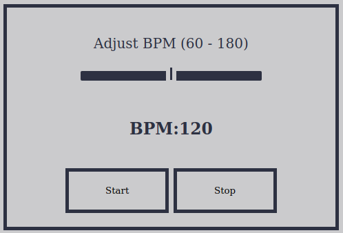

# CuberLearn - A website for intermediate cubers
This website provides CFOP algorithms and some useful tools for intermediate 
Rubik's Cube solver.

## Table of Contents
* [Project Demo](#project-demo)
* [Technologies](#technologies)
* [Future Feature](#future-feature)

## Project Demo
The live demo of this project can be found [here](http://ice.truman.edu/~tv1513/cuberlearn/index.html)

### CFOP Algorithms

### Average of 5 Calculator

### Cube Timer

### Metronome Trainer

## Technologies

* HTML
* CSS
* JavaScript
* PHP

## Future Feature
* A more robust metronome implementation
* Graphical and interactive 3D Rubik's Cube
